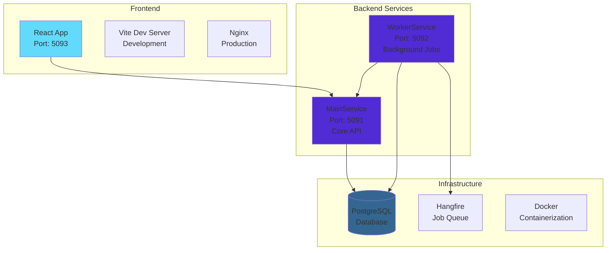

# TaskTrack App 🚀

A comprehensive task management application built with modern web technologies, featuring role-based access control, background job processing, and a beautiful responsive user interface with dark/light theme support.

## 🌟 Features

### 🔐 Authentication & Authorization
- **JWT-based authentication** with secure token management
- **Role-based access control** (Admin/User roles)
- **Auto-logout** on token expiration
- **Secure password hashing** using ASP.NET Core Identity
- **Protected routes** with React Router

### 📋 Task Management
- **Full CRUD operations** for tasks with rich details
- **Priority levels** (Low, Medium, High) with color-coded badges
- **Task status tracking** (Completed/In Progress)
- **Auto-assignment** for regular users
- **Admin task assignment/reassignment** to any team member
- **Task filtering** by priority level
- **Duplicate task name prevention** per user
- **Rich task descriptions** with timestamps
- **Task unassignment** capabilities

### 👥 User Management (Admin Only)
- **Create and manage users** with password requirements
- **Role assignment** and updates (Admin/User)
- **User deletion** with safety restrictions
- **Duplicate username prevention**
- **Interactive team member list** with clickable profiles
- **User details** and task assignment overview

### 🎨 User Interface & Experience
- **Dark/Light theme toggle** with system preference detection
- **Responsive design** for all screen sizes
- **Modern UI** with Shadcn/ui components
- **Real-time toast notifications** for all actions
- **Success/error feedback** for operations
- **Auto-populated edit forms** with existing data
- **Loading states** and skeleton components
- **Accessible components** with ARIA labels

### 🔄 Background Jobs & Automation
- **Scheduled email reminders** for incomplete tasks
- **Task cleanup service** for old completed tasks
- **Daily reminder jobs** with Hangfire integration
- **Automatic retry** mechanisms for failed jobs
- **Job monitoring** and logging
- **Email notifications** for task assignments

### 📊 Analytics & Monitoring
- **Individual user task views** with detailed statistics
- **Completion rate tracking** per user
- **Task distribution overview**
- **Priority and status visualization**
- **Comprehensive logging** with Serilog
- **API request monitoring**

## 🏗️ Architecture



### Service Architecture
- **MainService** - Core REST API for authentication, users, and tasks
- **WorkerService** - Background job processing with Hangfire
- **FrontService** - React SPA with TypeScript and modern UI components

### Infrastructure
- **PostgreSQL** - Primary database with Entity Framework migrations
- **Docker & Docker Compose** - Containerized deployment
- **Nginx** - Frontend proxy and static file serving in production
- **Hangfire** - Background job dashboard and queue management

## 🛠️ Technology Stack

### Backend (.NET 8)
- **ASP.NET Core Web API** - RESTful API development
- **Entity Framework Core 9.0** - ORM with PostgreSQL provider
- **JWT Authentication** - Microsoft.AspNetCore.Authentication.JwtBearer
- **Hangfire** - Background job processing and scheduling
- **Serilog** - Structured logging with multiple sinks
- **Swashbuckle** - OpenAPI/Swagger documentation

### Frontend (React 18)
- **React 18** with **TypeScript** - Type-safe component development
- **Vite** - Fast build tool and HMR dev server
- **React Router v6** - Client-side routing with protected routes
- **Tailwind CSS** - Utility-first CSS framework
- **Shadcn/ui** - Modern component library with Radix UI primitives
- **React Hook Form** - Form handling with validation
- **Context API** - State management for auth, tasks, and theme
- **Sonner** - Toast notifications
- **Lucide React** - Beautiful icons

### DevOps & Tools
- **Docker** - Multi-stage builds for production optimization
- **Docker Compose** - Multi-container orchestration
- **ESLint** - Code linting and formatting
- **TypeScript Compiler** - Type checking and compilation

## 🚀 Quick Start

### Prerequisites
- **Docker** and **Docker Compose** (required)
- **.NET 8 SDK** (for development)
- **Node.js 20+** (for frontend development)
- **Git** (for version control)

### 🐳 Production Deployment
```bash
# Clone the repository
git clone <repository-url>
cd TaskTrackApp

# Start all services with Docker
docker compose up -d

# Verify services are running
docker compose ps

# Access the application
# Frontend: http://localhost:5093
# Backend API: http://localhost:5091
# Swagger UI: http://localhost:5091/swagger
# Worker Service: http://localhost:5092
```

### 🛠️ Development Setup
```bash
# Use the interactive setup script
./setup-dev.sh

# Or manually:
# 1. Start backend services only
docker compose up mainservice workerservice -d

# 2. Start frontend in development mode
cd FrontService
npm install
npm run dev
```

The development script provides:
- **Choice between development and production modes**
- **Automatic service health checks**
- **Frontend hot reload** with Vite dev server
- **Backend containerization** for consistency

## 📡 API Documentation

### Authentication Endpoints
```http
POST /api/auth/login          # User authentication
POST /api/auth/test           # Token validation
```

### User Management (Admin Only)
```http
GET    /api/user/get               # Get all users
GET    /api/user/get/{id}          # Get specific user
POST   /api/user/create            # Create new user
PUT    /api/user/update/{id}       # Update user information
PATCH  /api/user/changeRole/{id}   # Change user role
DELETE /api/user/delete/{id}       # Delete user
```

### Task Management
```http
# Task CRUD Operations
GET    /api/task/get                    # Get all tasks (Admin only)
GET    /api/task/get/{id}              # Get specific task
GET    /api/task/gettasksbyuser/{id}   # Get user's tasks
POST   /api/task/create                # Create new task
PUT    /api/task/update/{id}           # Update task details
DELETE /api/task/delete/{id}           # Delete task (Admin only)

# Task Status & Priority
PATCH  /api/task/changeStatus/{id}     # Toggle task completion
PATCH  /api/task/prio/{id}             # Update task priority

# Task Assignment (Admin Only)
PATCH  /api/task/{id}/assign           # Assign task to user
PATCH  /api/task/reassign/{id}         # Reassign task to different user
PATCH  /api/task/unassign/{id}         # Remove task assignment

# Task Filtering
GET    /api/task/priofilter/{level}    # Filter by priority level
GET    /api/task/getIncompleteTasks    # Get incomplete tasks
GET    /api/task/getCompleteTasks      # Get completed tasks
```

### Background Jobs (WorkerService)
- **Daily task reminders** - Scheduled email notifications
- **Task cleanup** - Archive old completed tasks
- **System monitoring** - Health checks and logging

## 👤 Default Users & Authentication

| Username | Password | Role  | Description |
|----------|----------|-------|-------------|
| admin    | admin123 | Admin | Full system access, user management |

**Authentication Flow:**
1. Login with credentials to receive JWT token
2. Token stored in localStorage with auto-refresh
3. Protected routes redirect to login if unauthenticated
4. Auto-logout on token expiration

## 🎯 User Roles & Permissions

### 👑 Admin Users
- ✅ **Full task management** - View, create, edit, delete all tasks
- ✅ **Task assignment** - Assign/reassign tasks to any user
- ✅ **User management** - Create, edit, delete users and roles
- ✅ **System analytics** - View team performance and statistics
- ✅ **Background jobs** - Access to job dashboard and monitoring

### 👤 Regular Users
- ✅ **Personal tasks** - View and manage own tasks only
- ✅ **Task creation** - Create tasks (auto-assigned to self)
- ✅ **Task updates** - Modify priority, status, and details
- ✅ **Profile access** - View own user information
- ❌ **Limited scope** - Cannot access other users' data or admin features

## 🎨 Theme & UI Features

### Theme System
- **Dark/Light mode toggle** in the header
- **System preference detection** on first visit
- **Persistent theme selection** stored in localStorage
- **Smooth transitions** between themes
- **Consistent styling** across all components

### UI Components
- **Responsive design** - Mobile-first approach
- **Accessible components** - ARIA labels and keyboard navigation
- **Toast notifications** - Real-time feedback for user actions
- **Loading states** - Skeleton loaders and spinners
- **Form validation** - Real-time input validation with helpful messages

## 🔧 Configuration

### Environment Variables
```bash
# Frontend Development
VITE_API_BASE_URL=http://localhost:5091/api

# Frontend Production
VITE_API_BASE_URL=/api

# Backend (MainService & WorkerService)
ASPNETCORE_ENVIRONMENT=Development
ConnectionStrings__DefaultConnection=Host=host.docker.internal;Database=tasktrack;Username=postgres;Password=admin123;
```

### Database Configuration
- **Automatic migrations** on application startup
- **Seed data** includes default admin user
- **Connection pooling** for optimal performance
- **Structured logging** to database and files

### Hangfire Configuration
- **Dashboard** available at WorkerService endpoint
- **PostgreSQL storage** for job persistence
- **Automatic retries** for failed jobs
- **Scheduled jobs** for daily reminders and cleanup

## 🧪 Testing & Quality Assurance

### API Testing
```bash
# Use the provided test script
./test-api.sh

# Test worker jobs
./test-worker-jobs.sh

# Manual API testing
curl -X POST http://localhost:5091/api/auth/login \
  -H "Content-Type: application/json" \
  -d '{"userName":"admin","userPassword":"admin123"}'
```

### Development Tools
- **Hot reload** - Vite dev server with instant updates
- **TypeScript** - Compile-time type checking
- **ESLint** - Code quality and style enforcement
- **Swagger UI** - Interactive API documentation

## 🚦 Deployment Modes

### 📱 Development Mode
- **Frontend**: Vite dev server with hot reload (Port 5093)
- **Backend**: Docker containers for consistency
- **Database**: PostgreSQL in Docker
- **Benefits**: Fast development cycle, debugging capabilities

### 🚀 Production Mode
- **All services containerized** with Docker Compose
- **Nginx proxy** for optimized frontend serving
- **Multi-stage builds** for smaller image sizes
- **Health checks** and restart policies
- **Persistent volumes** for data and logs

## 📊 Monitoring & Logging

### Logging Strategy
- **Serilog** structured logging across all services
- **Multiple sinks**: Console, File, and PostgreSQL
- **Log levels**: Debug, Information, Warning, Error
- **Request/Response logging** for API calls
- **Background job logging** with Hangfire

### Health Monitoring
- **Service health checks** in setup script
- **Docker container monitoring** with restart policies
- **Database connection monitoring**
- **Job queue monitoring** via Hangfire dashboard

## 🤝 Contributing

1. **Fork the repository**
2. **Create a feature branch** (`git checkout -b feature/amazing-feature`)
3. **Make your changes** with proper testing
4. **Commit your changes** (`git commit -m 'Add amazing feature'`)
5. **Push to the branch** (`git push origin feature/amazing-feature`)
6. **Open a Pull Request**

### Development Guidelines
- Follow **TypeScript** best practices
- Use **conventional commits** for clear history
- Add **tests** for new features
- Update **documentation** for API changes
- Ensure **responsive design** for UI changes

## 📄 License

This project is licensed under the **MIT License** - see the LICENSE file for details.

## 🆘 Troubleshooting

### Common Issues

**Services not starting:**
```bash
# Check Docker status
docker info

# Check service logs
docker compose logs mainservice
docker compose logs workerservice
docker compose logs frontservice
```

**Frontend connection issues:**
```bash
# Verify backend is responding
curl http://localhost:5091/api/auth/login

# Check environment variables
echo $VITE_API_BASE_URL
```

**Database connection problems:**
```bash
# Check PostgreSQL is accessible
docker compose exec mainservice bash
# Inside container: test database connection
```

### Support Resources
1. **Console logs** - Check browser developer tools for frontend issues
2. **Service logs** - Use `docker compose logs -f [service-name]`
3. **API documentation** - Access Swagger UI at `/swagger`
4. **Network connectivity** - Verify all services can communicate

## 🎉 Recent Updates

- ✨ **Dark/Light theme toggle** with system preference detection
- 🔄 **Enhanced background job processing** with email notifications
- 🎨 **Improved UI components** with better accessibility
- 📱 **Mobile-responsive design** improvements
- 🔧 **Better error handling** and user feedback
- 📊 **Enhanced logging** and monitoring capabilities

---

**Built with ❤️ using modern web technologies and best practices**
